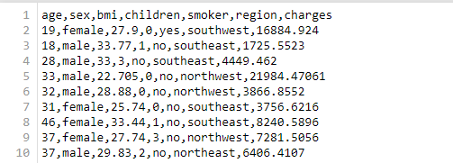

# U.S. Medical Insurance Costs


## Description

This project has been suggested by Codecademy as a group project of Data Scientist Path in order to give us an opportunity to connect with other learners, to put in practice our skills acquired so far and to search and apply the newers.

## Source

The data we are using is collected in a csv file named insurance.csv and provided by [Codecademy](https://www.codecademy.com/paths/data-science/tracks/dscp-python-portfolio-project/modules/dscp-group-project-u-s-medical-insurance-costs/informationals/dscp-group-project-u-s-medical-insurance-costs).

## Dataset

Our dataset contains ```1338 rows``` of information about U.S. medical insurance costs of patients. This dataset is provided as ```insurance.csv``` file that has different type of attributs as sex, age, bmi, children, smoker, region, and charges. It is important to note that we don't know how the data have been collected. Therefore, we don't know exactly the relationship between the variable attributs, but we can study the data satistically and infer some analysis.



## Goal

Our goal is based on the statistically view of the data. Therefore, our goal is to able to:
- to calculate the average age of the patients
- to globally calculate average insurance cost in the insurance data.
- to calculate the portion of males versus females in the insurance data.
- to have an insight on the cheapest and the most expensive insurance costs.
- to define a confidence interval of 95% for the insurance charges.
- to buid a dictionary with all patients information
- to categorize the patients insurance expenditures by region, by sex, and so forth.

## Actions

Firstly, we imported the csv and math modules.
The second action we took is to acquire the from our given source. For that purpose we used  the  [helper function](https://www.codecademy.com/paths/data-science/tracks/dscp-python-portfolio-project/modules/dscp-us-medical-insurance-costs/kanban_projects/us-medical-insurance-costs-portfolio-project) of loading csv file provided by Codecademy to load our data. But, as  the data in the insurance.csv file is organized in a tabular way where columns have same number of rows, each column header will represent an attribut variable that will be defined as a list variable so that we can import information in the form of python lists.
The third action consisted of manipulating the data in order to fulfil adequately our goal by defining a class and its methods. 
Finally, we proceeded with the testing of our class and its methods.

### Building out analysis functions or class methods

To achieve our goals, we will rely on a PatientData class with methods such as
- calculate_average_ages(): method that calculates the average ages of patients in insurance.csv
- calculate_percentage_sexes(): method that calculates the portion of males versus females in insurance.csv
- get_patient_distinct_regions(): method to locate distinct region patients are from
- calculate_average_medical_costs(): method to get the average yearly medical costs for each patient in insurance.csv
- insurance_charges_statistics(): method to get the mean, variance and standard deviation of the insurance data.
- patient_profile_dictionary(): method to define the profile of each patient.
- we also define and use static methods of the our class such as mean(), std() and margin_error() that accept a list as input.

### Testing our class and its methods

By testing our class and its methods, we can see that:

1. Regarding the age and the sex of the patient
    - The average age of the patients is 39.21 years old.
    - The percentage of male patients is 50.52%
    - The percentage of female patients is 49.48%.
    
2. Regarding the medical cost for the patients of the 4 distinct regions
    - The average yearly medical costs for each patient is 13270.42 dollars
    - All the information of the patient with  the **highest insurance charge** are: {'Age': 54, 'Sex': 'female', 'BMI': '47.41', 'Number of Children': '0', 'Smoker': 'yes', 'Region': 'southeast', 'Charge': '63770.42801'}
    - All the information of the patient with the **lowest insurance charge** are: {'Age': 18, 'Sex': 'male', 'BMI': '23.21', 'Number of Children': '0', 'Smoker': 'no', 'Region': 'southeast', 'Charge': '1121.8739'}
    
3. Regarding the distribution of the insurance charge over the 4 distinct region
    - By using the Z value of the corresponding [confidence interval](https://www.mathsisfun.com/data/confidence-interval.html) we want, we could calculate a margin error. Let's say we want a confidence interval of 95%, it's Z value is ```1.960```. Therefore, the margin error we got was ```648.65``` and 
```Confidence Interval of 95% = [12,621.77  13,919.07] ```
    - Furthermore, based on a confidence interval of 95%, we got that the Southeast region has the highest number of patients: ```238060``` with higher insurance charges than the average: ``` 13270.42 dollars ```, the patient with the highest insurance charge: ``` 63770.42801 dollars ```, and the lowest  insurance charge: ``` 1121.8739 dollars ``` in the country. It is following by the Northwest region, the Southwest region, and the Northeast region respectively with ``` 221909 ```, ``` 218976```, and ``` 215508``` patients.
